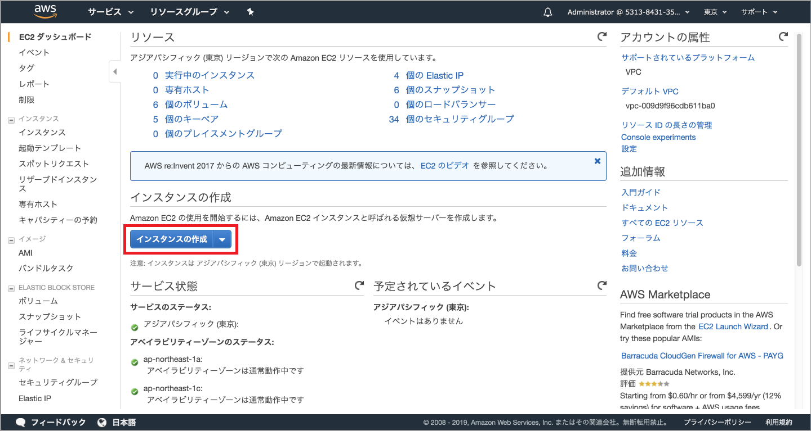
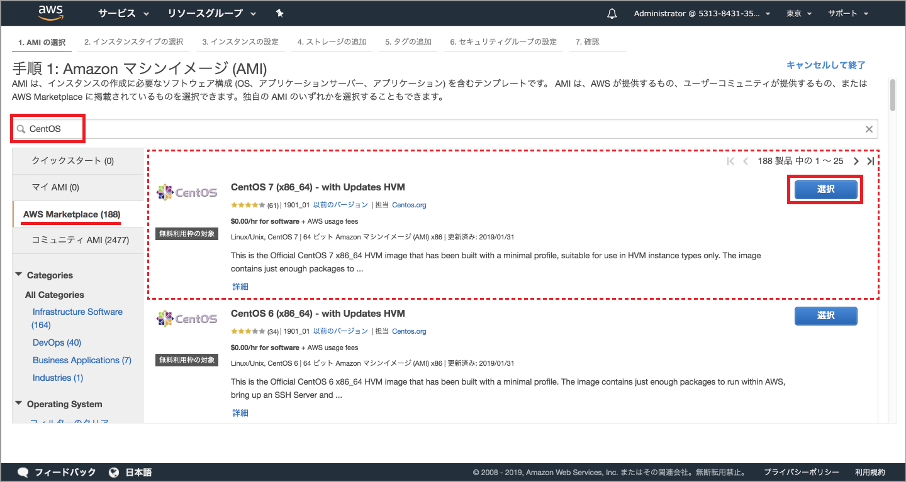
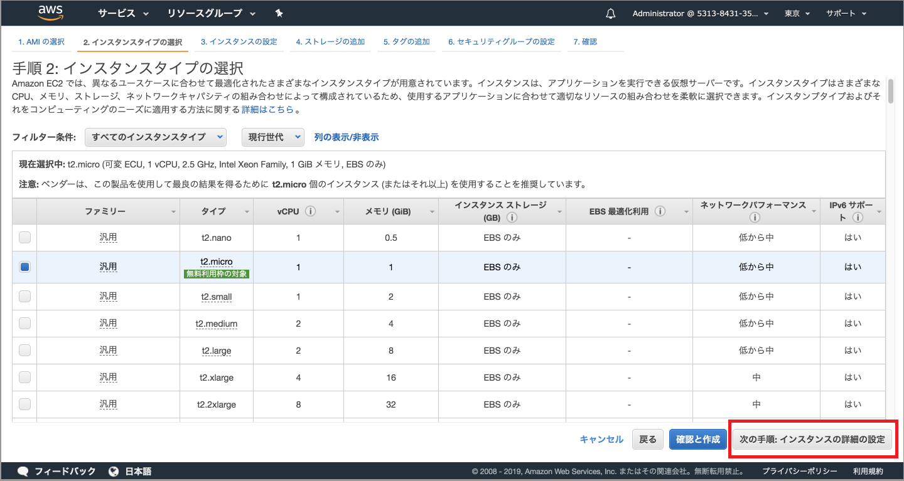
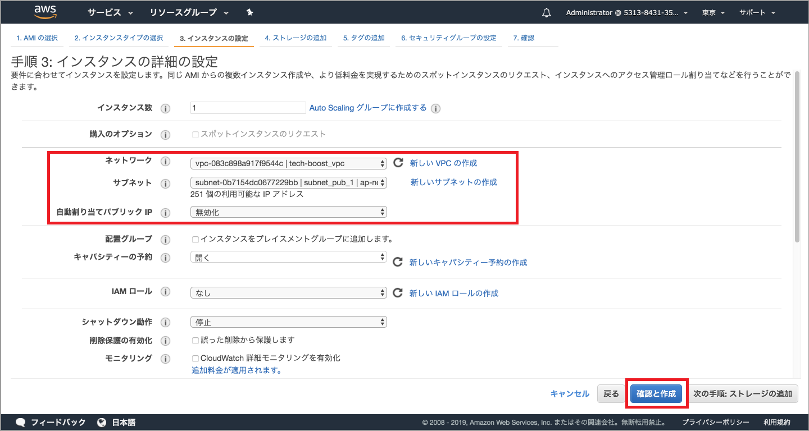
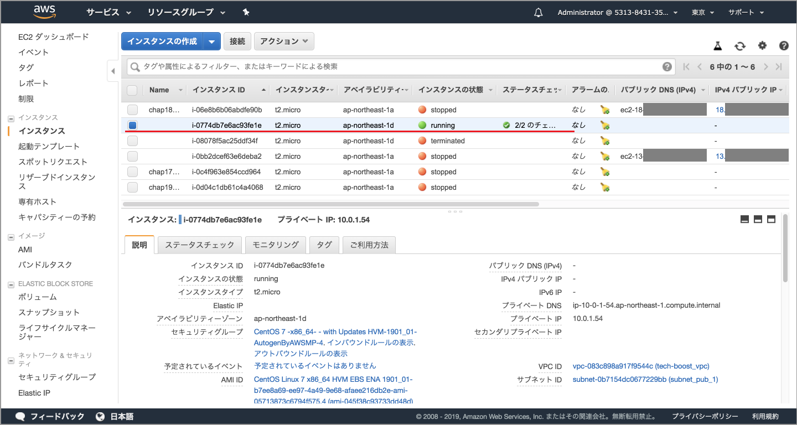
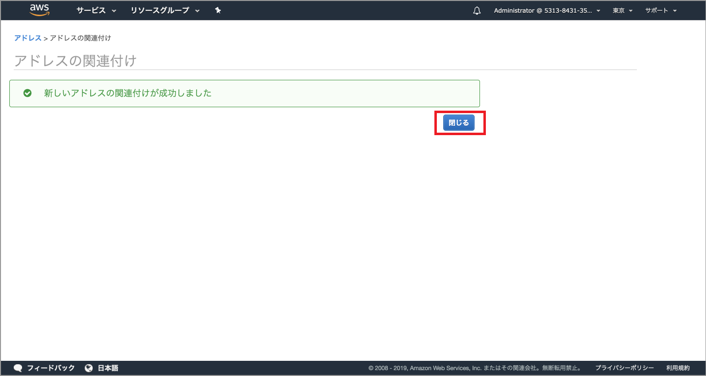

# (16)VPC内にEC2を立ち上げる 

## 1.本章の目的

- 前章で構築したVPC内にサーバインスタンスを立ち上げる。
- クライアントPCからVPC内のサーバインスタンスに接続する。

  
本章では、前章で構築したVPC内にサーバインスタンスを立ち上げます。今まで学習してきたインスタンスの立ち上げのおさらいになります。作業的に大きく異なるところはありません。

## 2.インスタンスの立ち上げ

### 2-1.インスタンスの立ち上げ

AWSマネジメントコンソールにて、EC2ダッシュボードを開いてください。



上図の「インスタンスの作成」ボタンをクリックしてください。



上図の「AWSMarketPlace」をクリックし、検索欄に「CentOS」と入力してEnterすると、一番上に「CentOS 7 (x86_64) - with Updates HVM」が表示されます。枠内の青い「選択」ボタンをクリックしてください。

選択ボタンを押した直後は利用料金の説明が表示されますが、とりあえずは目だけ通してContinueボタンをクリックしてください（説明割愛）。



上図でインスタンスタイプを選択します。ここではデフォルトのt2.microのままにしてください。そして「次の手順:インスタンスの詳細の設定」をクリックしてください。



上図で注意するのは「ネットワーク」と「サブネット」です。前章までで作成したものが表示されているかを確認してください。基本的に複数作っていなければデフォルトで表示されるので問題ありません。

「自動割り当てパブリックIP」は「無効化」を選択しましょう。ここはパブリックなIPを割り当てるかどうかを聞いています。後ほどElastic IPというサービスを使って固定IPを割り当てるので、ここは無効で大丈夫です。

確認したら「確認と作成」ボタンをクリックしてください。


上図は、選択した内容が一通り表示されています。「起動」ボタンをクリックして次へ進みましょう。


上図はキーペアの選択画面です。新たにキーペアを作成してもいいし、今までで作った既存のものを選択しても構いません。キーペアの作成または既存のキーを選択したら、チェックボックスにチェックを入れて「インスタンスの作成」ボタンをクリックしてください。

以下は作成中の画面です。


数分待って、画面下の「インスタンスの表示」ボタン（画面の下の方にスクロールするとあります）をクリックするか再びEC2ダッシュボードへ遷移すると、インスタンスができています。作成が終わっていれば、以下のような画面になっているはずです。下図でいうとインスタンスは5つあり、赤線を引いたインスタンスが先ほど作ったものです。



### 2-2.IPアドレスの割り当て

せっかく出来たインスタンスですが、このままでは接続できません。パブリックなIPアドレスがこのインスタンスに割り当たっていないからです。インスタンス作成の時にパブリックなIPアドレスを割り当てることもできますが、再起動するたびにIPアドレスが変わってしまいます。

よって、ElasticIPというサービスを使い、固定IPアドレスを取得し、それをインスタンスに割り当てます。

下図はEC2ダッシュボードです。


上図の「ElasticIP」をクリックしてください


上図の「新しいアドレスの割り当て」ボタンをクリックしてください。


何も選択することはないので「割り当て」ボタンをクリックしてください。


IPアドレスを1つゲットできました。「閉じる」ボタンをクリックしてください。取得済みIPアドレス一覧に遷移します。


上図で、取得できたIPアドレスの行のチェックボックスが入っていることを確認し「アクション」ボタンをクリックするとプルダウンメニューが開きます。


「アドレスの関連付け」をクリックしてください。


上図で「インスタンス」欄の右のプルダウンアイコンをクリックすると、インスタンスの一覧が開きます。ここで先ほど立ち上げたインスタンスを選択してください。選択した後「関連付け」ボタンをクリックしてください。



関連付けに成功しました。

EC2ダッシュボードに戻り、インスタンスの一覧をみてください。立ち上げたインスタンスにIPアドレスとパブリックDNS（簡単にいうと接続用URL）が表示されているのが分かります。


### 2-3.インスタンスに接続

今度はTeraTermまたはターミナルから接続してみましょう。目的のインスタンスのチェックボックスにチェックが入っていることを確認し「接続」ボタンをクリックしてください。


すでに10章で学びましたが、もう一度見てみましょう。

Windowsの方はTeraTerm、Macの方はコマンドラインにて表示されたコマンドを実行します。ユーザはrootではなくcentosです。よって、表示されたコマンドの「root」を「centos」に変えるだけでOKです。

そして、実行した結果、以下のようになれば接続完了です。

```
ssh -i "tech-boost_instance1insub1.pem" centos@ec2-13-114-202-44.ap-northeast-1.compute.amazonaws.com
The authenticity of host 'ec2-13-114-202-44.ap-northeast-1.compute.amazonaws.com (13.114.202.44)' can't be established.
ECDSA key fingerprint is SHA256:486sGTHehzm8nFvMpyvm8HyPq5bTFBm############.
Are you sure you want to continue connecting (yes/no)? (yesと入力してください）
[centos@ip-10-0-1-19 ~]$ 
```

Amazon Linuxと比べて超シンプルで味気ないくらいですが、これで接続完了です。あなたが苦労して立てたCentOSサーバはにこやかに微笑んでくれました。

Webサーバやデータベースのセットアップは、これから徐々に進めます。とりあえずは最低限の設定が終わったことに喜びを感じ、ひとまず終わりにしましょう。

学習を終える時は、インスタンスとの接続を切断した後EC2ダッシュボードでインスタンスを停止しておくことを忘れずに！

### 2-4.インスタンスとの切断、インスタンスの停止

切断は、exitと入力してEnterしてください。

これでまず接続が切れます。次にインスタンスの終了です。


インスタンスのチェックボックスにチェックが入っていることを確認し「アクション」→「インスタンスの状態」→「停止」を選んでください。

データが失われる等々のメッセージが表示されますが、構わず終了してください。

数分待って「インスタンスの状態」がstoppedになっていれば停止しましたことになります。ちなみに「終了」とはインスタンスの破棄を意味します。気をつけましょう。

使わないときは、セキュリティ的にも料金的にも停止するようにしましょう。

### 2-5. （補足1）IPアドレスの枯渇問題

ここで、補足説明としてIPアドレスの枯渇問題に触れておきましょう。

ElasitcIPにて、超簡単にグローバルIPアドレスを取得できました。ですがあまりむやみに取得するのは控えてください。

なぜなら、振り出せるIPの個数はすでに底をついているからです。

IPアドレスは理論上は43億個取れるのですが、すでにもう底をついて事業者間で融通し合っている状態です。よって、無意味にたくさん取得しないよう、私たち全員が気をつけなくてはなりません。

詳しくは「IPv4 枯渇」でググってみてください。　

### 2-6. （補足2）IPアドレスを別のインスタンスに関連付ける

ついでにもう一つ補足説明をしておきます。ElasticIPで取得したIPアドレスをインスタンスに割り当てて、解放（つまり割り当て解除）して、それをまた別のインスタンスに関連づけることができます。

しかしそれをすると、次にsshで接続するときに、以下のようなメッセージが表示されます。

```
@@@@@@@@@@@@@@@@@@@@@@@@@@@@@@@@@@@@@@@@@@@@@@@@@@@@@@@@@@@
@    WARNING: REMOTE HOST IDENTIFICATION HAS CHANGED!     @
@@@@@@@@@@@@@@@@@@@@@@@@@@@@@@@@@@@@@@@@@@@@@@@@@@@@@@@@@@@
IT IS POSSIBLE THAT SOMEONE IS DOING SOMETHING NASTY!
Someone could be eavesdropping on you right now (man-in-the-middle attack)!
It is also possible that the RSA host key has just been changed.
The fingerprint for the RSA key sent by the remote host is
xx:xx:xx:xx:xx:xx:xx:xx:xx:xx:xx:xx:xx:xx:xx:xx.
Please contact your system administrator.
```

度肝を抜くようなメッセージですが、これはセキュリティ問題ではありません。「前回接続した内容と変わってる！だってIPアドレスと紐付くホストが前回と異なっている！きっと悪い人がインスタンスとPCの間に入ってるよ！？（man-in-the-middle攻撃）」という警告です。

決してそうではなく、早い話が「IPに紐付くサーバが変わってる」からこのメッセージが表示されるのです。

以下のコマンドを実行することで解決できます。

```
ssh-keygen -R (IPアドレス)
```

これが何なのかはネットで簡単に調べられます。「EC2 接続 WARNING: REMOTE HOST IDENTIFICATION HAS CHANGED!」などで調べてみてください。

## 3.まとめ

次章では、いよいよWebサーバならびにアプリの設定が始まります。さらに実務的な内容になります。ガンバってついてきてくださいね！

この辺りで、一度復習がてらに課金を確認しておくのを忘れずに！
